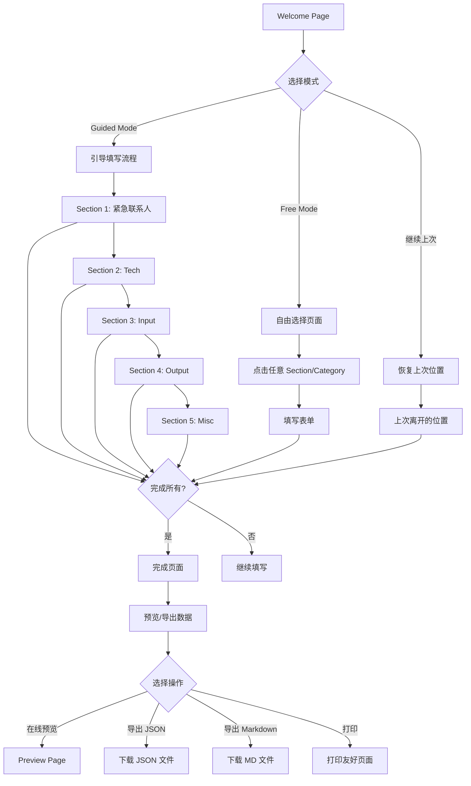

# Design Document: EOL Checklist Webapp

## Overview

本设计文档描述了 End-of-life Disaster Response Checklist 交互式 Web 应用的技术架构和实现方案。该应用将静态的 checklist.md 文档转换为一个用户友好的交互式向导，支持多种填写模式、本地数据持久化、数据导出导入等功能。

### 技术选型

- **前端框架**: React 18 + TypeScript
- **构建工具**: Vite
- **样式方案**: Tailwind CSS
- **状态管理**: React Context + useReducer
- **本地存储**: localStorage API
- **导出功能**: 
  - JSON: 原生 JSON.stringify
  - Markdown/HTML: 自定义模板渲染
- **测试框架**: Vitest + React Testing Library + fast-check (属性测试)

### 设计原则

1. **纯前端应用**: 所有数据存储在用户本地浏览器，不依赖后端服务
2. **渐进式体验**: 支持引导模式和自由模式，适应不同用户偏好
3. **数据安全**: 敏感信息本地存储，提供隐藏/显示切换
4. **响应式设计**: 适配桌面、平板、手机等多种设备
5. **可视化表单**: 使用平台特定的视觉设计，让表单更直观友好，而非冰冷的问卷

## Architecture

```
┌─────────────────────────────────────────────────────────────────┐
│                        EOL Checklist Webapp                      │
├─────────────────────────────────────────────────────────────────┤
│  ┌─────────────┐  ┌─────────────┐  ┌─────────────────────────┐  │
│  │   Pages     │  │  Components │  │      Context/State      │  │
│  ├─────────────┤  ├─────────────┤  ├─────────────────────────┤  │
│  │ WelcomePage │  │ Navigation  │  │ ChecklistContext        │  │
│  │ ChecklistPg │  │ ProgressBar │  │ - checklistData         │  │
│  │ ExportPage  │  │ SectionView │  │ - progressState         │  │
│  │ CompletePg  │  │ CategoryFrm │  │ - currentPosition       │  │
│  └─────────────┘  │ ItemForm    │  │ - mode (guided/free)    │  │
│                   │ SaveStatus  │  └─────────────────────────┘  │
│                   └─────────────┘                                │
├─────────────────────────────────────────────────────────────────┤
│  ┌─────────────────────────────────────────────────────────────┐│
│  │                      Services Layer                          ││
│  ├─────────────────────────────────────────────────────────────┤│
│  │ StorageService    │ ExportService    │ ChecklistDataService ││
│  │ - save()          │ - toJSON()       │ - getStructure()     ││
│  │ - load()          │ - toMarkdown()   │ - validateItem()     ││
│  │ - clear()         │ - toHTML()       │ - calculateProgress()││
│  │ - isAvailable()   │ - fromJSON()     │                      ││
│  └─────────────────────────────────────────────────────────────┘│
├─────────────────────────────────────────────────────────────────┤
│  ┌─────────────────────────────────────────────────────────────┐│
│  │                    Browser APIs                              ││
│  │              localStorage  │  File API (download)            ││
│  └─────────────────────────────────────────────────────────────┘│
└─────────────────────────────────────────────────────────────────┘
```

### 页面流程



### Preview Page (预览页面)

应用内置预览功能，用户可以在 webapp 中直接查看填写的所有内容，以类似原 checklist.md 的格式展示：

```
┌─────────────────────────────────────────────────────────────────┐
│  📋 End-of-life Disaster Response Checklist                     │
│  ─────────────────────────────────────────────────────────────  │
│  生成时间: 2024-01-15 14:30:00                                  │
│  [🖨️ 打印] [📥 导出 MD] [📥 导出 JSON] [✏️ 返回编辑]            │
├─────────────────────────────────────────────────────────────────┤
│                                                                 │
│  ## 紧急联系人通知                                               │
│                                                                 │
│  请按以下顺序通知这些人：                                        │
│  1. iMessages: Blake, Brother, Brother 2                        │
│  2. WhatsApp: Aaron                                             │
│  3. Facebook: Dad (电话号码在我手机里)                           │
│  ...                                                            │
│                                                                 │
│  ## Tech 技术                                                   │
│                                                                 │
│  ### Emails 邮箱                                                │
│  - me@fake.com - 密码存储在 xyz                                 │
│  - this@that.com - 转发到 me@fake.com                           │
│  ...                                                            │
│                                                                 │
│  ### Password Managers 密码管理器                                │
│  - KeePass                                                      │
│  - Master Password: ********** [👁️ 显示]                        │
│  ...                                                            │
│                                                                 │
└─────────────────────────────────────────────────────────────────┘
```

预览页面特点：
- 以可读的文档格式展示所有填写内容
- 敏感信息默认隐藏，可点击显示
- 支持直接打印（打印友好样式）
- 可从预览页面直接导出为各种格式
- 可随时返回编辑模式

## Visual Form Design (可视化表单设计)

为了让表单更加友好和直观，我们采用平台特定的视觉设计，模拟真实的登录界面和服务界面，而非传统的问卷形式。

### 平台特定表单卡片

每个社交平台/服务的表单将使用该平台的品牌颜色和图标，模拟其登录界面风格：

```typescript
interface PlatformCardProps {
  platform: PlatformType;
  icon: React.ReactNode;
  brandColor: string;
  fields: PlatformField[];
  data: PlatformData;
  onChange: (data: PlatformData) => void;
}

type PlatformType = 
  | 'imessage' | 'whatsapp' | 'facebook' | 'skype' | 'discord' 
  | 'google' | 'instagram' | 'twitter' | 'github' | 'linkedin'
  | 'email' | 'bank' | 'paypal' | 'crypto';
```

### 平台视觉设计示例

#### 社交媒体账户卡片
```
┌─────────────────────────────────────────┐
│  [Discord Logo]  Discord                │
│  ─────────────────────────────────────  │
│                                         │
│  📧 Email or Username                   │
│  ┌─────────────────────────────────┐   │
│  │ your_username#1234              │   │
│  └─────────────────────────────────┘   │
│                                         │
│  🔒 Password                            │
│  ┌─────────────────────────────────┐   │
│  │ ••••••••••••        👁️ Show    │   │
│  └─────────────────────────────────┘   │
│                                         │
│  📝 Notes (谁应该继承这个账户?)         │
│  ┌─────────────────────────────────┐   │
│  │ Transfer to David               │   │
│  └─────────────────────────────────┘   │
│                                         │
│  ✅ 已填写                              │
└─────────────────────────────────────────┘
```

#### 银行账户卡片
```
┌─────────────────────────────────────────┐
│  [Bank Icon]  银行账户                   │
│  ─────────────────────────────────────  │
│                                         │
│  🏦 银行名称                            │
│  ┌─────────────────────────────────┐   │
│  │ Fak Bank                        │   │
│  └─────────────────────────────────┘   │
│                                         │
│  💳 账户类型                            │
│  ○ Checking  ○ Savings  ○ Both         │
│                                         │
│  🔢 PIN 码                              │
│  ┌─────────────────────────────────┐   │
│  │ ••••                  👁️ Show  │   │
│  └─────────────────────────────────┘   │
│                                         │
│  📝 用途说明                            │
│  ┌─────────────────────────────────┐   │
│  │ 主要账户，可支付国际账单         │   │
│  └─────────────────────────────────┘   │
│                                         │
│  [+ 添加另一个银行账户]                  │
└─────────────────────────────────────────┘
```

### 平台品牌配置

```typescript
const platformBranding: Record<PlatformType, PlatformBrand> = {
  discord: {
    name: 'Discord',
    icon: DiscordIcon,
    primaryColor: '#5865F2',
    backgroundColor: '#36393f',
    textColor: '#ffffff',
  },
  whatsapp: {
    name: 'WhatsApp',
    icon: WhatsAppIcon,
    primaryColor: '#25D366',
    backgroundColor: '#ffffff',
    textColor: '#000000',
  },
  facebook: {
    name: 'Facebook',
    icon: FacebookIcon,
    primaryColor: '#1877F2',
    backgroundColor: '#ffffff',
    textColor: '#000000',
  },
  // ... 其他平台
};
```

### 紧急联系人可视化

紧急联系人部分使用聊天气泡风格，让用户更直观地理解这是"要通知的人"：

```
┌─────────────────────────────────────────┐
│  📱 紧急联系人通知列表                   │
│  ─────────────────────────────────────  │
│                                         │
│  当我离开后，请按以下顺序通知这些人：     │
│                                         │
│  ┌─────────────────────────────────┐   │
│  │ 1. [iMessage] Blake             │ ✏️│
│  │    Brother, Brother 2           │   │
│  └─────────────────────────────────┘   │
│                                         │
│  ┌─────────────────────────────────┐   │
│  │ 2. [WhatsApp] Aaron             │ ✏️│
│  └─────────────────────────────────┘   │
│                                         │
│  ┌─────────────────────────────────┐   │
│  │ 3. [Facebook] Dad               │ ✏️│
│  │    电话号码在我手机里            │   │
│  └─────────────────────────────────┘   │
│                                         │
│  [+ 添加联系人]                          │
└─────────────────────────────────────────┘
```

### 订阅服务可视化

订阅服务使用服务 Logo 和状态标签：

```
┌─────────────────────────────────────────┐
│  📺 订阅服务管理                         │
│  ─────────────────────────────────────  │
│                                         │
│  ┌──────────┐ ┌──────────┐ ┌──────────┐│
│  │ YouTube  │ │ Netflix  │ │ Spotify  ││
│  │ Premium  │ │          │ │ Family   ││
│  │ [保留]   │ │ [取消]   │ │ [保留]   ││
│  └──────────┘ └──────────┘ └──────────┘│
│                                         │
│  ┌──────────┐ ┌──────────┐ ┌──────────┐│
│  │ Discord  │ │ NordVPN  │ │ Hulu     ││
│  │ Nitro    │ │          │ │          ││
│  │ [取消]   │ │ [取消]   │ │ [取消]   ││
│  └──────────┘ └──────────┘ └──────────┘│
│                                         │
│  [+ 添加订阅服务]                        │
└─────────────────────────────────────────┘
```

### 设备和硬件可视化

家庭实验室和网络设备使用设备图标和连接图：

```
┌─────────────────────────────────────────┐
│  🖥️ 家庭实验室设备                       │
│  ─────────────────────────────────────  │
│                                         │
│  ⚠️ 重要：出售前必须格式化硬盘！          │
│                                         │
│  ┌─────────────────────────────────┐   │
│  │ 🖥️ 大黑盒子 (服务器)              │   │
│  │ 继承人: Janet                    │   │
│  │ 需要格式化: ❌ 否                 │   │
│  └─────────────────────────────────┘   │
│                                         │
│  ┌─────────────────────────────────┐   │
│  │ 💻 NUC 小黑盒                     │   │
│  │ 继承人: Janet                    │   │
│  │ 需要格式化: ✅ 是                 │   │
│  └─────────────────────────────────┘   │
│                                         │
│  ┌─────────────────────────────────┐   │
│  │ 🍎 Mac 电脑                       │   │
│  │ 继承人: Peter                    │   │
│  │ 需要格式化: ✅ 是                 │   │
│  │ ⚠️ 需要从 Find My 注销           │   │
│  └─────────────────────────────────┘   │
└─────────────────────────────────────────┘
```

### 可视化组件库

新增以下可视化组件：

```typescript
// 平台卡片组件
interface PlatformCardProps {
  platform: PlatformType;
  children: React.ReactNode;
  status?: 'empty' | 'partial' | 'complete';
}

// 联系人气泡组件
interface ContactBubbleProps {
  platform: PlatformType;
  name: string;
  notes?: string;
  order: number;
  onEdit: () => void;
  onDelete: () => void;
}

// 订阅服务卡片组件
interface SubscriptionCardProps {
  service: string;
  icon?: string;
  action: 'keep' | 'cancel' | 'transfer';
  transferTo?: string;
  notes?: string;
  onChange: (data: SubscriptionData) => void;
}

// 设备卡片组件
interface DeviceCardProps {
  type: 'server' | 'computer' | 'phone' | 'network' | 'iot';
  name: string;
  inheritor?: string;
  needsFormatting?: boolean;
  specialInstructions?: string;
  onChange: (data: DeviceData) => void;
}

// 银行账户卡片组件
interface BankAccountCardProps {
  bankName: string;
  accountType: 'checking' | 'savings' | 'both';
  pin?: string;
  purpose?: string;
  onChange: (data: BankAccountData) => void;
}
```

## Components and Interfaces

### 核心组件

#### 1. App Component
应用根组件，提供 Context Provider 和路由。

```typescript
interface AppProps {}

const App: React.FC<AppProps> = () => {
  return (
    <ChecklistProvider>
      <Router>
        <Layout>
          <Routes />
        </Layout>
      </Router>
    </ChecklistProvider>
  );
};
```

#### 2. Navigation Component
侧边栏导航组件，显示所有 Section 和 Category，支持折叠。

```typescript
interface NavigationProps {
  sections: Section[];
  currentPath: string;
  progress: ProgressState;
  onNavigate: (path: string) => void;
  collapsed: boolean;
  onToggleCollapse: () => void;
}
```

#### 3. ProgressBar Component
进度条组件，显示整体和各部分完成进度。

```typescript
interface ProgressBarProps {
  overall: number; // 0-100
  sections: { id: string; name: string; progress: number }[];
}
```

#### 4. SectionView Component
Section 视图组件，显示一个 Section 的所有 Category。

```typescript
interface SectionViewProps {
  section: Section;
  data: SectionData;
  onDataChange: (categoryId: string, data: CategoryData) => void;
  mode: 'guided' | 'free';
  onNext?: () => void;
  onSkip?: () => void;
}
```

#### 5. CategoryForm Component
Category 表单组件，渲染一个 Category 的所有字段。

```typescript
interface CategoryFormProps {
  category: Category;
  data: CategoryData;
  onChange: (data: CategoryData) => void;
  description?: string;
}
```

#### 6. ItemForm Component
单个 Item 表单组件，支持动态添加/删除。

```typescript
interface ItemFormProps {
  item: Item;
  value: ItemValue;
  onChange: (value: ItemValue) => void;
  onDelete?: () => void;
  sensitive?: boolean;
}
```

#### 7. SaveStatus Component
保存状态指示器组件。

```typescript
interface SaveStatusProps {
  status: 'saved' | 'saving' | 'error';
  lastSaved?: Date;
}
```

### 服务接口

#### StorageService
本地存储服务。

```typescript
interface StorageService {
  save(data: ChecklistData): void;
  load(): ChecklistData | null;
  saveProgress(progress: ProgressState): void;
  loadProgress(): ProgressState | null;
  clear(): void;
  isAvailable(): boolean;
  getUsedSpace(): number;
}
```

#### ExportService
数据导出服务。

```typescript
interface ExportService {
  toJSON(data: ChecklistData): string;
  fromJSON(json: string): ChecklistData;
  toMarkdown(data: ChecklistData): string;
  toHTML(data: ChecklistData): string;
  downloadFile(content: string, filename: string, mimeType: string): void;
}
```

#### PreviewService
数据预览/展示服务。

```typescript
interface PreviewService {
  generatePreview(data: ChecklistData): PreviewDocument;
  renderToHTML(preview: PreviewDocument): string;
}

interface PreviewDocument {
  title: string;
  generatedAt: string;
  sections: PreviewSection[];
}

interface PreviewSection {
  name: string;
  categories: PreviewCategory[];
}

interface PreviewCategory {
  name: string;
  description?: string;
  items: PreviewItem[];
}

interface PreviewItem {
  label: string;
  value: string | string[];
  sensitive?: boolean; // 敏感字段在预览中显示为 ****
}
```

#### ChecklistDataService
Checklist 数据结构服务。

```typescript
interface ChecklistDataService {
  getStructure(): ChecklistStructure;
  validateItem(item: Item, value: ItemValue): ValidationResult;
  calculateProgress(data: ChecklistData): ProgressState;
  getNextCategory(currentPath: string): string | null;
  getPrevCategory(currentPath: string): string | null;
}
```

## Data Models

### ChecklistStructure
Checklist 的静态结构定义。

```typescript
interface ChecklistStructure {
  sections: Section[];
}

interface Section {
  id: string;
  name: string;
  description?: string;
  categories: Category[];
}

interface Category {
  id: string;
  name: string;
  description?: string;
  helpText?: string;
  items: ItemDefinition[];
}

interface ItemDefinition {
  id: string;
  label: string;
  type: ItemType;
  placeholder?: string;
  helpText?: string;
  sensitive?: boolean;
  required?: boolean;
  repeatable?: boolean; // 是否可添加多个
  fields?: ItemDefinition[]; // 复合字段
}

type ItemType = 
  | 'text' 
  | 'textarea' 
  | 'email' 
  | 'tel' 
  | 'url' 
  | 'password' 
  | 'number'
  | 'select'
  | 'checkbox'
  | 'group'; // 复合类型
```

### ChecklistData
用户填写的数据。

```typescript
interface ChecklistData {
  version: string;
  lastModified: string; // ISO timestamp
  sections: Record<string, SectionData>;
}

interface SectionData {
  categories: Record<string, CategoryData>;
}

interface CategoryData {
  items: Record<string, ItemValue | ItemValue[]>; // 支持单值和多值（repeatable）
}

type ItemValue = string | number | boolean | Record<string, ItemValue>;
```

### ProgressState
进度状态。

```typescript
interface ProgressState {
  overall: number; // 0-100
  sections: Record<string, SectionProgress>;
  currentPosition: {
    sectionId: string;
    categoryId: string;
  };
  mode: 'guided' | 'free';
  lastVisited: string; // ISO timestamp
}

interface SectionProgress {
  progress: number; // 0-100
  status: 'not_started' | 'in_progress' | 'completed';
  categories: Record<string, CategoryProgress>;
}

interface CategoryProgress {
  progress: number;
  status: 'not_started' | 'in_progress' | 'completed';
  filledItems: number;
  totalItems: number;
}
```

### ValidationResult
验证结果。

```typescript
interface ValidationResult {
  valid: boolean;
  errors: ValidationError[];
}

interface ValidationError {
  field: string;
  message: string;
}
```

### ExportMetadata
导出元数据。

```typescript
interface ExportMetadata {
  exportedAt: string; // ISO timestamp
  version: string;
  appVersion: string;
}

interface ExportedData {
  metadata: ExportMetadata;
  data: ChecklistData;
  progress: ProgressState;
}
```


## Correctness Properties

*A property is a characteristic or behavior that should hold true across all valid executions of a system—essentially, a formal statement about what the system should do. Properties serve as the bridge between human-readable specifications and machine-verifiable correctness guarantees.*

### Property 1: Navigation Order Consistency

*For any* current position in the checklist (Section and Category), calling `getNextCategory()` should return the next Category in the predefined order, and calling `getPrevCategory()` should return the previous Category. The sequence should be deterministic and consistent.

**Validates: Requirements 1.2, 2.4**

### Property 2: Data Persistence Round-Trip

*For any* valid `ChecklistData` object, saving it to localStorage and then loading it back should produce an equivalent object. Similarly, exporting to JSON and importing back should produce an equivalent object.

**Validates: Requirements 3.2, 4.2, 4.5**

### Property 3: Auto-Save Trigger

*For any* form field modification, the `StorageService.save()` function should be called within the debounce window (500ms). The saved data should reflect the modification.

**Validates: Requirements 3.1**

### Property 4: Export Content Completeness

*For any* `ChecklistData` object, the exported Markdown/HTML should contain all filled values, and the export should include a valid timestamp.

**Validates: Requirements 4.3, 4.4**

### Property 5: Field Type Mapping

*For any* `ItemDefinition` with `sensitive: true`, the rendered input should have `type="password"`. *For any* `ItemDefinition` with a specific `type` (email, tel, url, number), the rendered input should have the corresponding HTML5 input type.

**Validates: Requirements 5.2, 7.4**

### Property 6: Dynamic Item Operations

*For any* repeatable Item, adding a new instance should increase the array length by 1, and deleting an instance should decrease the array length by 1. The remaining items should preserve their values.

**Validates: Requirements 7.3**

### Property 7: Progress Calculation

*For any* `ChecklistData` state:
- The overall progress percentage should equal the weighted average of all Section progresses
- Each Section progress should equal the average of its Category progresses
- A Category with at least one filled Item should have status "in_progress"
- A Category with all Items filled should have status "completed"
- A Category with no Items filled should have status "not_started"

**Validates: Requirements 8.1, 8.2, 8.3, 8.4**

### Property 8: Responsive Layout

*For any* viewport width between 320px and 2560px, the application should render without horizontal overflow and all interactive elements should be accessible.

**Validates: Requirements 6.1**

### Property 9: Content Completeness

*For any* Category in the checklist structure, there should be a non-empty description or helpText. *For any* complex field (type: 'group' or fields with multiple sub-fields), there should be placeholder text or helpText.

**Validates: Requirements 7.1, 7.2**

## Error Handling

### Storage Errors

| Error Scenario | Detection | User Feedback | Recovery |
|---------------|-----------|---------------|----------|
| localStorage 不可用 | `StorageService.isAvailable()` 返回 false | 显示警告 banner，提示用户数据无法保存 | 提供导出功能作为备选 |
| 存储空间不足 | 捕获 QuotaExceededError | 显示警告，提示用户导出数据并清理 | 提供导出和清除功能 |
| 数据损坏 | JSON.parse 失败 | 显示错误提示，询问是否重置 | 提供重置选项，保留导出备份 |

### Import Errors

| Error Scenario | Detection | User Feedback | Recovery |
|---------------|-----------|---------------|----------|
| 文件格式错误 | JSON.parse 失败 | 显示"文件格式无效"错误 | 允许重新选择文件 |
| 版本不兼容 | 版本号检查 | 显示版本不兼容警告 | 尝试迁移或提示手动处理 |
| 数据结构无效 | Schema 验证失败 | 显示具体验证错误 | 允许部分导入有效数据 |

### Form Validation Errors

| Error Scenario | Detection | User Feedback | Recovery |
|---------------|-----------|---------------|----------|
| 必填字段为空 | 提交时验证 | 字段下方显示红色提示 | 聚焦到第一个错误字段 |
| 格式错误（邮箱、URL等） | 输入时验证 | 字段下方显示格式提示 | 显示正确格式示例 |

## Testing Strategy

### 测试框架配置

- **单元测试**: Vitest
- **组件测试**: React Testing Library
- **属性测试**: fast-check
- **覆盖率目标**: 80%+

### 单元测试

单元测试用于验证特定示例、边界条件和错误处理：

1. **StorageService 测试**
   - 测试 localStorage 可用时的保存/加载
   - 测试 localStorage 不可用时的错误处理
   - 测试存储空间不足的错误处理

2. **ExportService 测试**
   - 测试空数据导出
   - 测试包含敏感字段的数据导出
   - 测试导入格式错误的文件

3. **ChecklistDataService 测试**
   - 测试边界位置的导航（第一个/最后一个 Category）
   - 测试空数据的进度计算
   - 测试完全填写的进度计算

4. **组件测试**
   - 测试欢迎页面渲染两种模式选择
   - 测试导航组件的折叠/展开
   - 测试敏感字段的显示/隐藏切换

### 属性测试

属性测试用于验证通用属性，每个测试运行至少 100 次迭代：

1. **Feature: eol-checklist-webapp, Property 1: Navigation Order Consistency**
   - 生成随机的当前位置
   - 验证 getNextCategory 和 getPrevCategory 返回正确的顺序

2. **Feature: eol-checklist-webapp, Property 2: Data Persistence Round-Trip**
   - 生成随机的 ChecklistData
   - 验证 save → load 和 toJSON → fromJSON 的往返一致性

3. **Feature: eol-checklist-webapp, Property 3: Auto-Save Trigger**
   - 生成随机的字段修改
   - 验证 save 函数被调用且数据正确

4. **Feature: eol-checklist-webapp, Property 4: Export Content Completeness**
   - 生成随机的 ChecklistData
   - 验证导出的 Markdown/HTML 包含所有值和时间戳

5. **Feature: eol-checklist-webapp, Property 5: Field Type Mapping**
   - 生成随机的 ItemDefinition
   - 验证渲染的 input 类型正确

6. **Feature: eol-checklist-webapp, Property 6: Dynamic Item Operations**
   - 生成随机的 repeatable Item 数组
   - 验证添加/删除操作的正确性

7. **Feature: eol-checklist-webapp, Property 7: Progress Calculation**
   - 生成随机的 ChecklistData 填写状态
   - 验证进度计算的正确性

8. **Feature: eol-checklist-webapp, Property 8: Responsive Layout**
   - 生成随机的 viewport 宽度 (320-2560)
   - 验证无水平溢出

9. **Feature: eol-checklist-webapp, Property 9: Content Completeness**
   - 遍历所有 Category
   - 验证都有描述或帮助文本

### 测试数据生成器

```typescript
// fast-check 生成器示例
const checklistDataArbitrary = fc.record({
  version: fc.constant('1.0.0'),
  lastModified: fc.date().map(d => d.toISOString()),
  sections: fc.dictionary(
    fc.string(),
    sectionDataArbitrary
  )
});

const itemValueArbitrary = fc.oneof(
  fc.string(),
  fc.integer(),
  fc.boolean(),
  fc.dictionary(fc.string(), fc.string())
);
```
